# Report of HW1

Huanyu Wang 522030910212

## Task 1

### Question 1

1. 有问题，曝光度太高，导致背景的富士山看不清楚，整体亮度偏高。

2. 可以使用python cv2库，将图片转为灰度图，后使用matplotlib库绘制直方图，结果如下：

	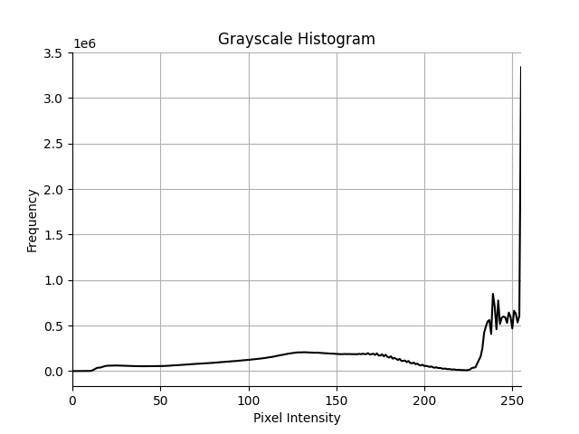

能够看出，直方图分布聚集于高灰度值区域，说明整体亮度过高，有过曝现象。

### Code Task

同样，使用python cv2库读取图片并转化为灰度图，后使用matplotlib库绘制直方图 (详见Task_1.py)，结果如下：

	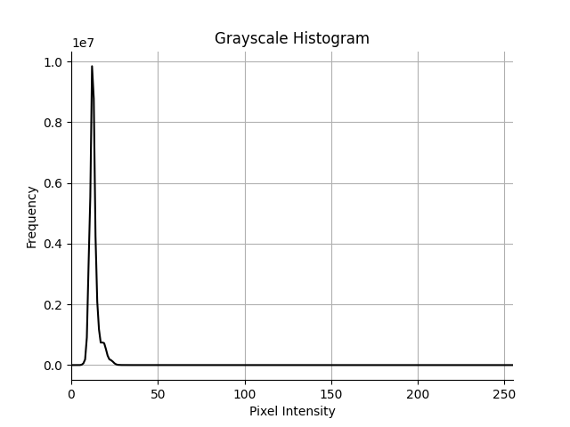

分布聚集于低灰度值区域，说明亮度偏低。使用cv2库的均衡化函数，能够得到如下均衡化后的直方图和灰度图：

	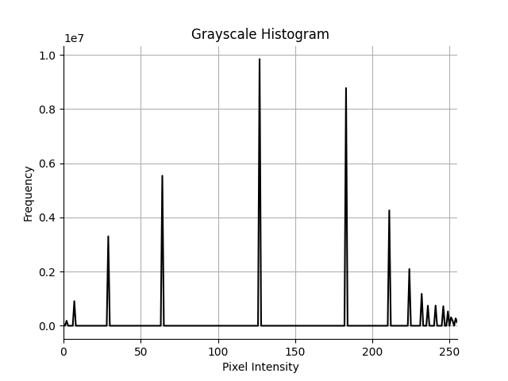
    

此时可以清楚看出云层和天气情况。

### Question 2

1. 直方图均衡化的原理是通过计算每个灰度值的像素数量 (概率)，由累计概率分布函数来重新调整像素值，使得灰度值得分布接近均匀分布，从而增强图像得细节，平衡可见性。

2. 直方图均衡化前后，图片从亮度较暗变到亮度较亮，使得云层等细节更加明显，但同时也增强了背景一些噪音 (?还是星星) 的亮度，使得图片整体比较“杂乱”。对应的直方图，原本像素值聚集于低灰度值区域，均衡化后，像素灰度值分布较为均匀，提高了高灰度值区域的像素分布，使得图片整体亮度和对比度提高。

3. **我认为**，在图片存在过亮或过暗，细节信息不明显，需要调整整体亮度或增加对比度的情况下，直方图均衡化是有用的。但就像上面的例子，均衡化后图片噪声变得更明显，如果原图本身存在很多噪音，或需要更清晰的细节显示，这样的方法还不能达到最终目标，反而可能适得其反。

4. 看起来当晚的天气是：晴朗，略微有云。从直方图均衡化后的图片来看，夜晚有云，但云层比较薄且少，仍能够看到大片星空，因此应该是晴朗的。

## Task 2

### Question 1

1. 车牌形状规则，是一个尺寸固定 (蓝黑牌，黄牌，摩托前后牌之间不同) 的矩形，并且边框有颜色 (白色)。同时，一个车牌只有一个背景色，且背景色和文字颜色对比度高 (蓝白，黑白，黄黑，绿黑)，且文字数量较为固定。

2. **我认为**，Canny算子更适合检测车牌边缘信息。因为Canny算子：采用高斯滤波平滑图像，能够减少噪音干扰；使用非极大抑制提取清晰的边缘；同时有高低双阈值检测，能够更好提取完整的边缘信息。而且Canny算子支持任意角度的边缘，更适合不同场景下的车牌图片。以下是一个Canny算子提取的车牌边缘信息 (LP13)：

	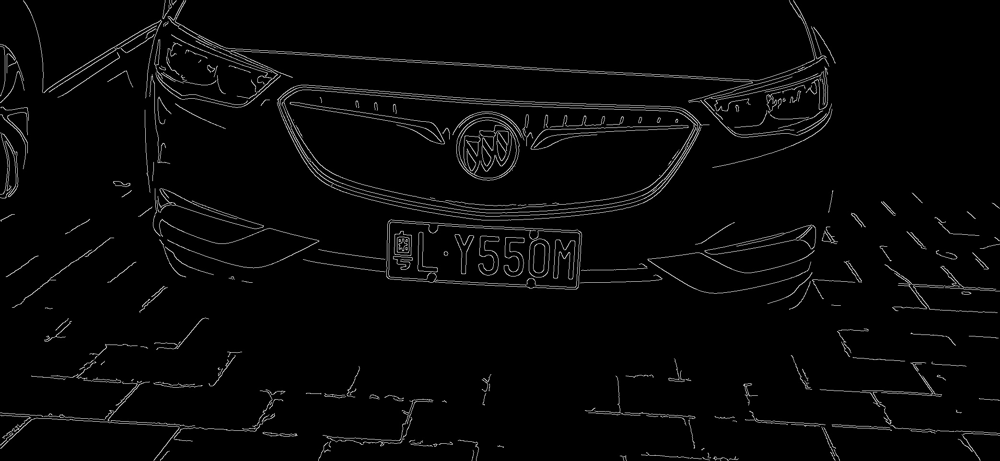

但是单独作用Canny算子，会将整个图片的所有边缘信息一并提取，尽管车牌的边缘十分清晰，但是仍需要一些额外的操作来分离车牌和其余元素。

3. **我认为**，图片中的拍摄光照，车牌污渍等因素都可能引入噪音，增加不正确的边缘信息，从而对车牌检测造成干扰，Canny算子通过高斯滤波，能够一定程度缓解噪音的影响。此外，图片中的其余部分也会引入很多边缘，如车标、地砖、前灯等元素，可能具有和车牌相似的边缘形态，会对后续的分离造成影响，或许可以尝试通过车牌特殊的背景颜色或者裁剪等方式，准确提取车牌的信息。如果拍摄时候天气不好，下雨或起雾，或者拍摄时过曝，可能导致车牌边缘模糊，可以使用直方图均衡化等方法增强对比度和调整亮度。车牌在图片中的角度也可能影响边缘检测，但是Canny算子支持任意角度的边缘提取。

### Code Task

(详见Task_2.py) 以下是Sobel，Canny，Laplacian三种算子的初次边缘提取效果：

	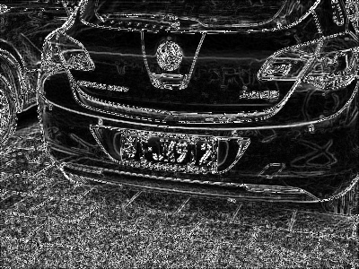
    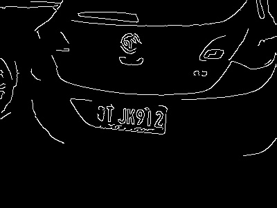
    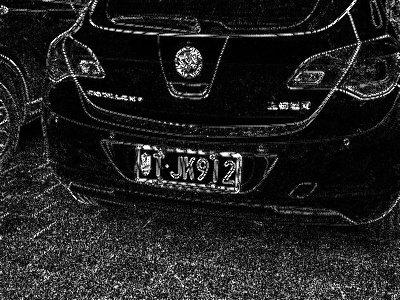

可以看出，Sobel和Laplacian的效果图中存在太多噪音，而且对于车牌边缘的提取并不如Canny，因此选择Canny算子进行更进一步的参数调整。

为了尽量截取图片中的车牌部分，不选择其余部分，我采取了以下思路 (尽管在尝试过后，**我感觉这个思路有待完善**，可能加入一些增强对比度操作会更鲁棒)：
- 首先做**如下假设**：
	- 车牌颜色固定 (在此我只对蓝牌进行截取，其余颜色车牌方法类似)
	- 车牌与车身颜色不会完全一致 (可以都是蓝色，可以有同色部分，但是由于车身具有几何形状，打光后的颜色会有渐变，不像车牌作为一个平面，色泽不太会随位置变化)
	- 拍摄角度大致水平 (车牌可以倾斜，但是不太可能直接转90°，车牌的长宽比较关键)
- **具体方法**：
	1. 确定车牌蓝色的 HSV 值区间 (不使用 RGB 值，因为 HSV 对于颜色的分离更准确有效，且能够让车牌在不同光照下都能被提取，鲁棒性更高)
	2. 用上述得到的区间截取图片中的部分，得到近似扯车牌区域 mask (但是同时其余部分落在这个区间内的颜色也会被截取)
	3. 通过一个3\*1的核和一个3\*6的核分别对上述 mask 进行开运算和膨胀，均迭代2次 (能够更清晰提取一个横向的车牌，并填补车牌中白字的空洞。我尝试了同时提取白色，并跟蓝色进行像素级或运算，但因为图片中白色的部分通常更多，效果不如只提取蓝色有区分度)
	4. 应用Canny算子，将得到的结果和上述mask做像素级与运算，得到车牌区域边缘

在我“不懈”调参下，mask和最终效果如下：

	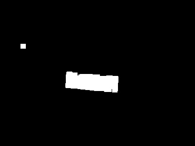
    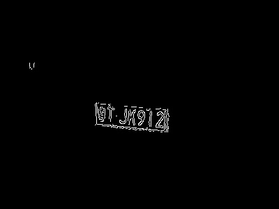

可以看出，截取效果非常的好，几乎能够完全得到车牌的边缘信息。

但是，你可能会质疑，这样通过颜色来确定车牌区域，**是不是很不稳定**？答案是，还真是 (其实没有啦，也没那么不稳定)，对于单个图片例子可能会有过拟合的调参，但是我在给出的三个车牌图片上都进行了实验，略微放宽 HSV 阈值区间，得到以下结果：

	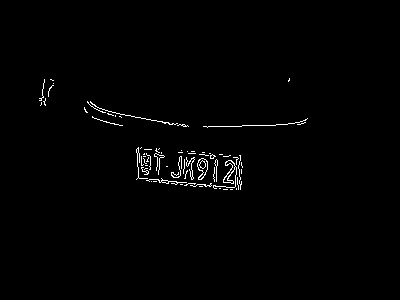
    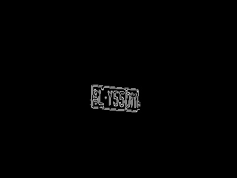
    

尽管阈值放宽后会有一些其他边缘信息的加入，但是总的来说，这样的方法效果是比较好的，对于蓝色系车的车牌同样能够准确提取。**我认为**或许对原图做一些更进一步操作，比如增加颜色对比度等，能够更好区分车牌和其余部分，但是目前来看，效果会更好。

### Question 2

1. Sobel和Laplacian的效果图中存在太多噪音，而且对于倾斜的车牌，边缘提取效果较差，并且同时提取到很多背景中不需要的边缘信息。Canny能够支持去噪，结果中噪音较少，且能够支持任意角度的边缘，同时还可以动态调整高低双阈值，得到清晰连贯的边缘。

2. 环境噪声会让特征提取结果中产生很多噪音的边缘，Canny算子包含的高斯滤波，通过设置合适的核大小和标准差，能够很好去除这些噪音。

3. **我认为**Canny算子表现最佳，因为涉及到倾斜车牌的提取，但是Canny算子对于非倾斜车牌的提取可能有局限，因为任意角度反而会提取到更多背景中的别的元素的边缘，需要额外去除。

4. 什么？！原来这个task更关注车牌边缘信息吗，我在调参试验的过程中同时参考了对于车牌上文字信息的提取。**特别是这个“粤”字**，在进行闭运算和膨胀时，核大小不合适很容易让这个字中的复杂笔画受到影响。因此，我认为对于车牌上字的特征提取对于车牌识别也很有帮助。