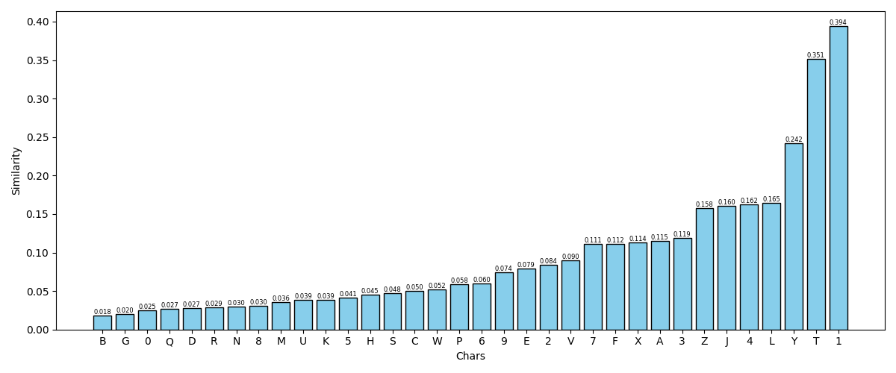
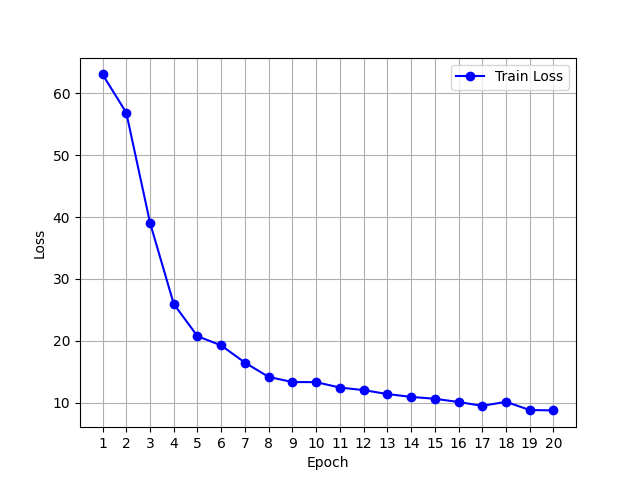
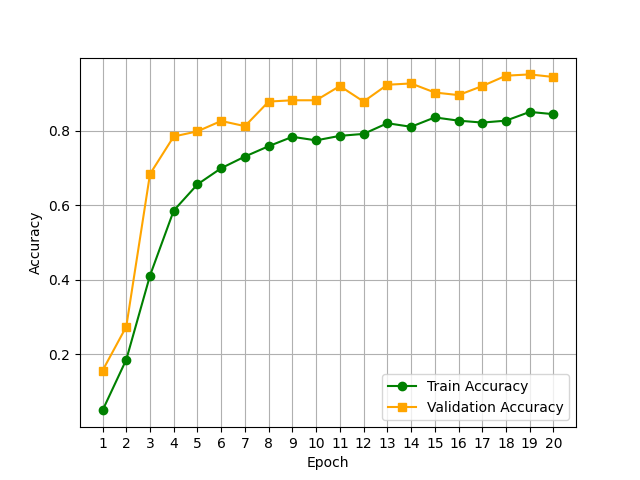
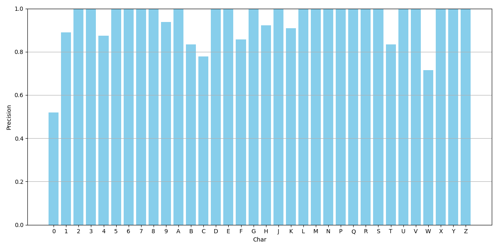

# Report of HW2

Huanyu Wang 522030910212

## Task 1

### Question 1

1. 可以将图集中图像先和待分类的字符图像统一尺寸，然后进行二值化。对于每个图集中图片，计算和待分类图片的像素级均方误差 (MSE)，通过选择误差最小的一批图片对应的字符作为分类结果。

2. 以下是三种特征提取方法：
    - 边缘方向直方图：通过Canny算子提取字符的边缘，计算每个边缘像素的梯度方向，将方向量化为8个方向，统计各方向上的边缘像素数量，得到一个直方图。
    - SIFT尺度不变特征变换：通过在不同尺度下检测图像的关键点，并提取其局部梯度方向直方图来描述图像局部区域特征，对旋转、尺度变换和一定程度的仿射变换具有较强的不变性，适用于没那么“正”的字符图像。
    - 投影特征：在水平/垂直方向统计黑色像素数量，得到固定长度的一维向量，可以用于计算相似度。

    上述方法中，**我认为**投影特征是最好的方法，因为该方法实现简单，计算速度快，且能很好地表示字符的基本轮廓结构，对于本任务中简单标准的字符应当会有很好的效果。

3. 可以使用以下两种方法来比较向量相似度：
    - 欧氏距离：将特征向量看作高维空间中的点，计算点之间的欧氏距离。距离越小代表两个向量越相似。简单直观，但是会收到向量尺度的影响。
    - 余弦相似度：用点积和模长，计算两个向量夹角的余弦值，越接近1代表两个向量方向越一致，即越相似。对向量尺度不敏感，更关注方向。

### Code Task

具体代码见code_1.py，分别用三种方法和两种相似度比较方法，对每个测试图片进行判断 (汉字单独处理)
```python
# 维数为60
general_projection_features = build_features_general('projection')
# 维数为8
general_edge_hist_features = build_features_general('edge_hist')
# 维数为128
general_sift_features = build_features_general('sift')

general_projection_results = recognize_general(general_projection_features, feature_type='projection')
general_edge_hist_results = recognize_general(general_edge_hist_features, feature_type='edge_hist')
general_sift_results = recognize_general(general_sift_features, feature_type='sift')
```

**P.S.** 对于待识别字符图片，预处理 (resize，黑底白字) 结果存于./ProcessedTask1

对于数据集中每个字符，取特征向量的平均，再和目标字符做相似度计算，得到结果如下：
|  Img   | Correct | Projection-Cosine | Projection-Euclidean | EdgeHist-Cosine | EdgeHist-Euclidean | SIFT-Cosine | SIFT-Euclidean |
|--------|---------|-------------------|----------------------|-----------------|--------------------|-------------|----------------|
| 02.png | B       | B                 | G                    | B               | B                  | 8           | 8              |
| 03.png | D       | N                 | 0                    | Z               | Z                  | 4           | 4              |
| 04.png | O       | N                 | U                    | G               | G                  | 3           | 3              |
| 05.png | 9       | V                 | V                    | G               | G                  | 6           | 6              |
| 06.png | 1       | 1                 | 1                    | 1               | 1                  | 1           | V              |
| 07.png | Q       | 0                 | 0                    | C               | C                  | Q           | Q              |
| 08.png | 8       | G                 | G                    | 5               | 5                  | B           | B              |
| 09.png | G       | G                 | G                    | G               | G                  | G           | G              |

可以看出，效果并不好，**我认为**是因为数据集中的图片质量普遍较低，且大小和噪声多变，直接取特征向量的平均会削弱字符特征，放大噪音。或许可以借鉴作业1中的多种预处理方法，来降噪增加准确率，但是我尝试了如下方法：对于数据库中同一字符的所有图片，都和目标字符做相似度，然后取相似度的均值作为检测标准。效果相对上表有所提升，但是仍然不尽人意。

因此，我最后尝试了以下方法：同样是对于同一字符的所有图片，先逐一计算相似度，但是取相似度最低值作为检测标准。这样虽然可以很好利用到数据集中的优质图片，但是对整个数据集其余图片的利用率很低，且计算量大。不过，鉴于这种方法具有较好的准确度，实际情况中可以动态调整，如进一步选择**top-k**等方法判断相似度。在此，我最终选择了使用min作为标准的方法，结果如下：

|  Img   | Correct | Projection-Cosine | Projection-Euclidean | EdgeHist-Cosine | EdgeHist-Euclidean | SIFT-Cosine | SIFT-Euclidean |
|--------|---------|-------------------|----------------------|-----------------|--------------------|-------------|----------------|
| 02.png | B       | B                 | G                    | P               | P                  | 8           | 8              |
| 03.png | D       | N                 | 0                    | L               | L                  | 5           | 5              |
| 04.png | O       | N                 | G                    | 6               | 6                  | 6           | 6              |
| 05.png | 9       | 9                 | V                    | 6               | 6                  | 6           | 6              |
| 06.png | 1       | 1                 | 1                    | H               | H                  | 1           | 1              |
| 07.png | Q       | Q                 | 0                    | C               | C                  | Q           | Q              |
| 08.png | 8       | 8                 | 8                    | 5               | Q                  | G           | G              |
| 09.png | G       | G                 | G                    | 9               | 9                  | G           | G              |

由上表可知，Projection-Cosine方法准确率最高，在数字和字符上取得了75%的准确率。

此时，在汉字上，粤 -> 粤；沪 -> 陕，并没有做到完全准确。但是**我认为**在本任务中数据集质量直观且数据量较少的情况下，这种方法有其优势。

基于上述方法，以下是选择02.png (B)，使用Projection-Cosine方法，和各个字符图像的相似度：

<div align="center">
    
</div>

可以看出，事实上本方法对于相似字符的区分度不是很高，例如B, G, 0, 8等字符，还有优化空间。

### Question 2

1. Projection-Cosine方法准确率最高，在数字和字符上取得了75%的准确率，汉字上取得了50%的准确率。

2. 对于B/8，我选择的方法在以上测试集上似乎能够正确分类，但是会将D，O错误分类为N。**我认为**这可能是因为字符N在Projection方法下有些“全面”了，字符部分广泛占据整个图片，因此容易成为错误分类的结果。

3. **我认为**我的方法的确能够在更大数据集上取得更好效果。因为更大的数据集，更多的字符图片，意味着更容易取到高质量的字符图片 (除非更大的数据集反而导致更低质量图片，那么另说)，我的方法很依赖与 min / top-k 相似度，因此数据集质量越高，应当会有越好的效果。

    **但是**，上述方法在大数据集上的计算量会增大很多，实际应用上不应该采取注意比较的方法，而应该先求平均再比较，会更合理。

## Task 2

详细实现见 code_2.py

1. **模型结构**：选用 LeNet 风格的轻量级卷积神经网络，适合处理小尺寸图像的字符识别任务。通过两层卷积-池化提取局部特征，再通过两层全连接层实现分类。
    ```python
    def forward(self, x):           # [1, 40, 20]
        x = F.relu(self.conv1(x))   # -> [6, 36, 16]
        x = self.pool1(x)           # -> [6, 18, 8]
        x = F.relu(self.conv2(x))   # -> [16, 14, 4]
        x = self.pool2(x)           # -> [16, 7, 2]
        x = x.view(-1, 16 * 7 * 2)  # Flatten
        x = F.relu(self.fc1(x))     # -> 120
        x = F.relu(self.fc2(x))     # -> 84
        x = self.fc3(x)             # -> num_classes (34)
    ```

2. **损失函数和优化器**：采用多分类任务的常见损失函数 CrossEntropyLoss，以及深度学习应用最广泛的优化器 Adam。
    ```python
    criterion = nn.CrossEntropyLoss()
    optimizer = optim.Adam(model.parameters(), lr=0.001)
    ```

3. **训练细节**：
    - 无需采用GPU，直接在CPU上进行训练，型号为 Intel(R) Xeon(R) Silver 4310 CPU @ 2.10GHz，内存大小无限制。
    - epoch：20；batch size：64；lr：1e-3；time：~ 10s；train_val ratio：8:2
    - **数据增强**：经过测试，数据增强能够显著提升模型准确率，因此采用仿射变换-遮挡-灰度标准化作为训练过程数据增强，在测试时仅应用灰度标准化。
        ```python
        train_transform = transforms.Compose([
            transforms.RandomAffine(degrees=10, translate=(0.05, 0.05), scale=(0.95, 1.05)),
            transforms.RandomErasing(p=0.2),
            transforms.Normalize((0.5,), (0.5,))
        ])

        val_transform = transforms.Compose([
            transforms.Normalize((0.5,), (0.5,))
        ])
        ```

4. 以下是训练曲线，以及train/val准确率曲线：

<div align="center">
    
    
</div>

5. 最终模型在test集上的准确率为：**93.06%**，整体mAP为：**0.8782**。以下是各类别准确率：

<div align="center">
    
</div>

5. 从上述可视化曲线来看，epoch = 20已经足够，并且整体没有出现过拟合现象，令人满意。从结果来看，深度学习方法显著提高了字符识别的准确率，同时基于我对深度学习的知识，此方法同样具有很好的泛化性。在一些难度较大的字符上，识别效果仍会低于其他字符，但整体仍然表现很好。不过，深度学习代码较为复杂，且数据集构造比较关键，因此成本也较高。

## Survey

1. 是的，我有能使用的GPU资源。
2. 是的，或许对于别的同学来说，使用“交我算”会是一个好选择，但是我仍然倾向于使用我自己的GPU，调试起来或许会比较方便。